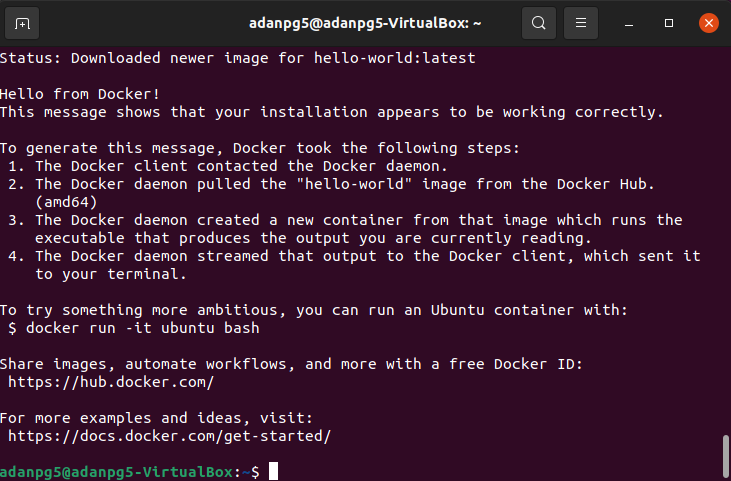
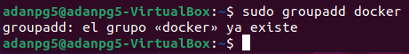
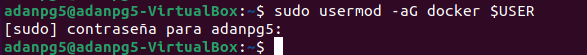
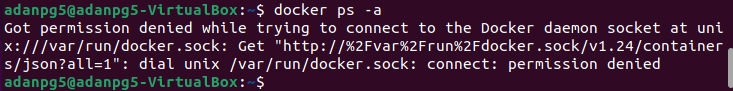
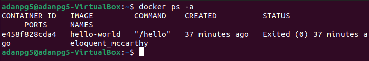
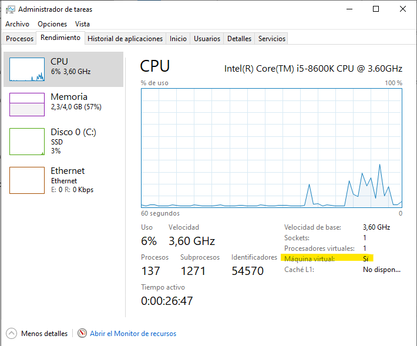
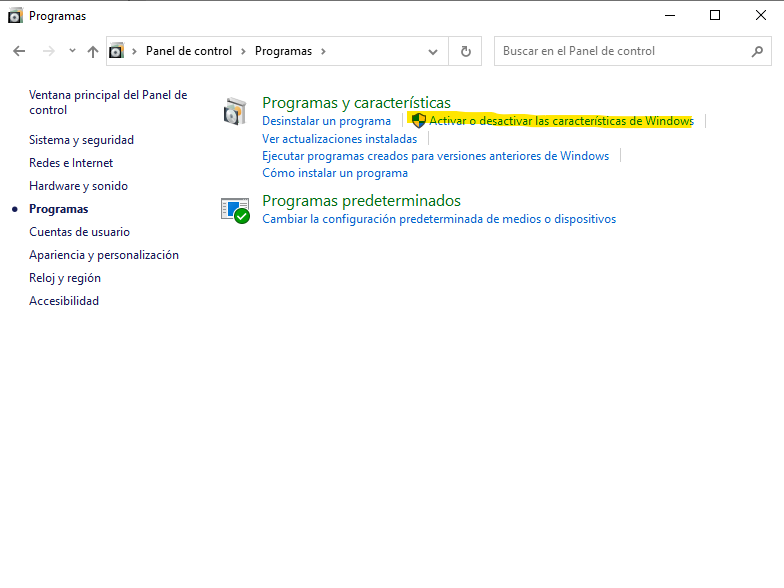
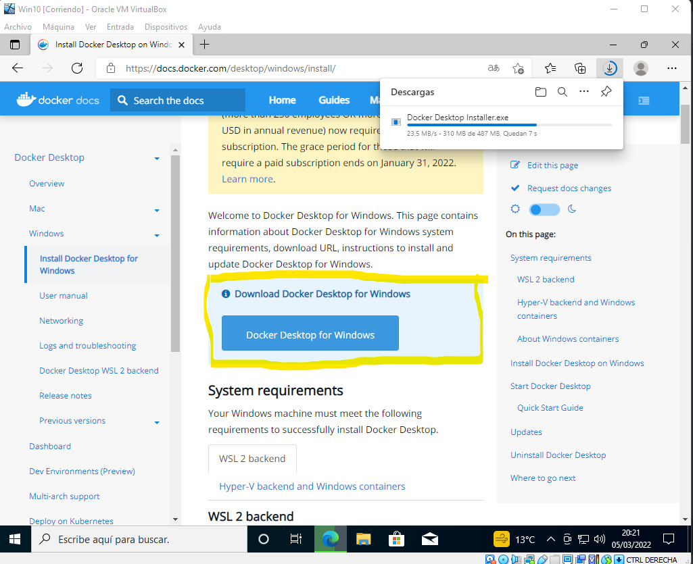
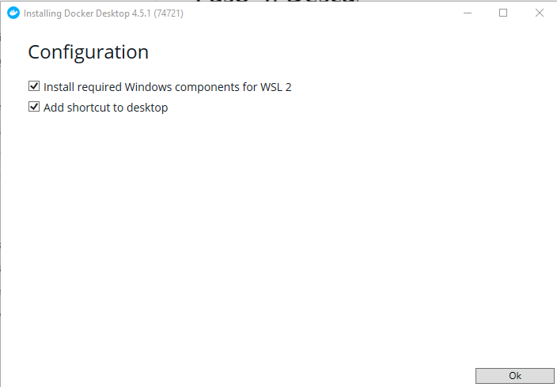
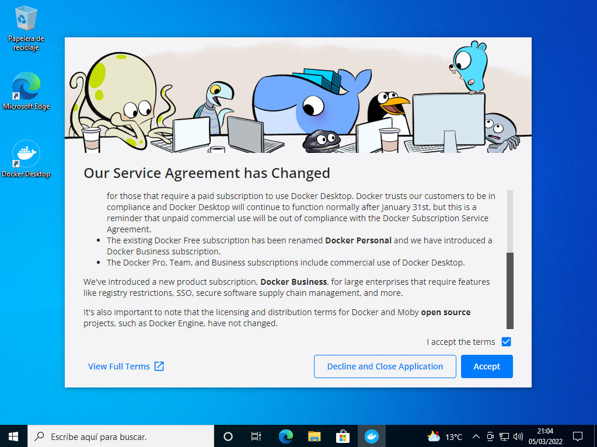

# Trabajando con Docker


  - [¿Qué es Docker?](#qué-es-docker)
  - [¿Por qué Docker?](#por-qué-docker)
    - [Instalación de Docker Engine (Ubuntu).](#instalación-de-docker-engine-ubuntu)
  - [Docker Compose](#docker-compose)
    - [Instalación.](#instalación)
  
## ¿Qué es Docker?
* Docker es una plataforma de software que le permite crear, probar e implementar aplicaciones rápidamente. Docker empaqueta software en unidades estandarizadas llamadas contenedores que incluyen todo lo necesario para que el software se ejecute, incluidas bibliotecas, herramientas de sistema, código y tiempo de ejecución. Con Docker, puede implementar y ajustar la escala de aplicaciones rápidamente en cualquier entorno con la certeza de saber que su código se ejecutará.

## ¿Por qué Docker?
* Solo se tiene que programar la aplicación una sola vez.
* Se obtiene una mayor consistencia entre los entornos de prueba y los entornos de producción.
* Se obtiene mayor modularidad.
* Los contenedores son gratuitos y de código abierto.
* Las instancias de Docker son más ligeras que las de otras plataformas como KVM, VMWare...
* Retorno de la inversión y ahorro de costes.
* Compatibilidad y mantenimiento más fácil.
* Despliegue y escalabilidad rápidos.
* Plataformas multi-cloud.
* Para concluir cabe destacar que los contenedores Docker comparten sus sistemas operativos para ser ejecutados como procesos aislados independientemente del sistema operativo de la máquina host. Docker se enorgullece, según sus propias palabras, de que sus contenedores se "pueden ejecutar en cualquier máquina, en cualquier infraestructura y en cualquier nube". La portabilidad, flexibilidad y simplicidad que esto permite son las razones fundamentales que explican por qué Docker ha sido capaz de crear tanta captación en tan poco tiempo.

## Instalación de Docker Engine (Ubuntu).
* Primero que nada, actualizaremos nuestros repositorios: `sudo apt-get update`.
* Instalaremos el software necesario: 
```
sudo apt-get install \
    ca-certificates \
    curl \
    gnupg \
    lsb-release
```
* Ahora añadimos la clave GPG oficial de Docker para que nuestro PC admita la herramienta: `curl -fsSL https://download.docker.com/linux/ubuntu/gpg | sudo gpg --dearmor -o /usr/share/keyrings/docker-archive-keyring.gpg`
* Añadimos el repositorio Docker. 
```
echo \
  "deb [arch=$(dpkg --print-architecture) signed-by=/usr/share/keyrings/docker-archive-keyring.gpg] https://download.docker.com/linux/ubuntu \
  $(lsb_release -cs) stable" | sudo tee /etc/apt/sources.list.d/docker.list > /dev/null
  ```
  * Volvemos a actualizar los repositorios: `sudo apt-get update`
  * Instalamos docker: `sudo apt-get install docker-ce docker-ce-cli containerd.io`
  * Comprobamos que se ha instalado y la versión: `docker version`
  * Otra opción para comprobar que se ha instalado sin problema es utilizar `sudo docker run hello-world`, que ejecuta una imagen test en un contenedor, nos mostrará un mensaje.


A la larga se nos hará pesado trabajar siempre con el comando sudo, ya que estaremos continuamente utilizando docker. Por lo tanto, haremos unas modificaciones para poder omitirlo.

 * Comprobamos si nuestro sistema ha generado el grupo docker, si no lo ha creado, lo crearemos nosotros con `sudo groupadd docker`.
  
 * Ahora añadimos nuestro usuario al grupo docker, dándole así todos los permisos: `sudo usermod -aG docker $USER`. La variable $(USER) funciona para especificar el usuario actual, en caso de querer añadir otro usuario puedes indicar el nombre exacto.

 * Intentamos utilizar el comando `docker ps -a`:

Nos indica que no tenemos permiso aún, ya que tenemos que cerrar sesión o bien reiniciar.
Una vez reiniciemos, lo volvemos a intentar y:

Ya podemos utilizar docker sin **sudo**.

## Docker Compose

* Con Compose utilizaremos ficheros en formato YAML, que nos servirán para definir la configuración de la aplicación en cuestión. De esta manera podemos, con un solo comando, crear e iniciar los servicios configurados en estos ficheros.

   Su forma de uso es la siguiente:

   Definir el entorno de las aplicaciones con Dockerfile (del que hablamos en el artículo anterior), para que así pueda reproducirse en cualquier lugar.
Establecer los servicios que componen las aplicación en un fichero docker-compose.yml, para que se pueda utilizar en un entorno aislado.
Ejecutar la herramientadocker-compose, para así iniciar la aplicación.
En el fichero YML podemos definir, entre otras cosas, la imagen o imágenes que queremos utilizar, la exposición de puertos o los volúmenes (De todo estos ya hemos hablando también antes).

### Instalación.

* Para descargarlo, ejecutamos el siguiente comando (¡¡OJO!! la versión, en mi caso, instalo la 1.29.2, pero para comprobar cuál es la última acceder a https://github.com/docker/compose/releases):
```
sudo curl -L "https://github.com/docker/compose/releases/download/1.29.2/docker-compose-$(uname -s)-$(uname -m)" -o /usr/local/bin/docker-compose
```

* Damos permisos a nuestro usuario para utilizar docker compose: `sudo chmod +x /usr/local/bin/docker-compose`

* Con el comando `sudo ln -s /usr/local/bin/docker-compose /usr/bin/docker-compose` creamos un enlace simbólico a la ruta para acortarla y que se haga más cómodo a la hora de trabajar.

* `docker-compose --version` para comprobar la versión instalada.

## Docker Desktop (Windows).

* Para poder instalar Docker en sistemas Windows, tenemos que tener activada en nuestra BIOS la opción "BIOS-level hardware virtualization support". Esta opción no suele venir activada por defecto.

  Para comprobar si está activada, abriremos el Task Manager y lo haremos de la siguiente manera:



  En caso de que en el apartado "Máquina virtual" nos aparezca **NO**, deberemos activar la opción mencionada anteriormente.

  Una vez realizado, debemos entrar en "**Panel de control -> Programas -> Activar o desactivar características de Windows**"



  Buscaremos las opciones "**Subsistema de Windows para Linux**" y "**Plataforma de máquina virtual**" y marcaremos ambas. 

* Teniendo todo listo, para descargarlo accederemos a https://docs.docker.com/desktop/windows/install



  Antes de instalarlo, accedemos a https://docs.microsoft.com/es-es/windows/wsl/install-manual#step-4---download-the-linux-kernel-update-package y descargamos una actualización para utilizar el kernel de linux.

  Abrimos este último paquete y lo instalamos. Ahora, sí instalaremos el docker desktop descargado anteriormente. Dejaremos la configuración del setup por defecto.

  

  Una vez finalizada la instalación, nos pedirá cerrar sesión y volver a entrar. Una vez hecho, esperamos en la pantalla de inicio ya que Docker se abrirá automáticamente pasados unos segundos.

   

Cuando la instalación haya finalizado, nos aparecerá un tutorial para poner en práctica Docker Desktop. En mi caso, omito dicho tutorial ya que trabajaremos sobre el sistema Linux.
